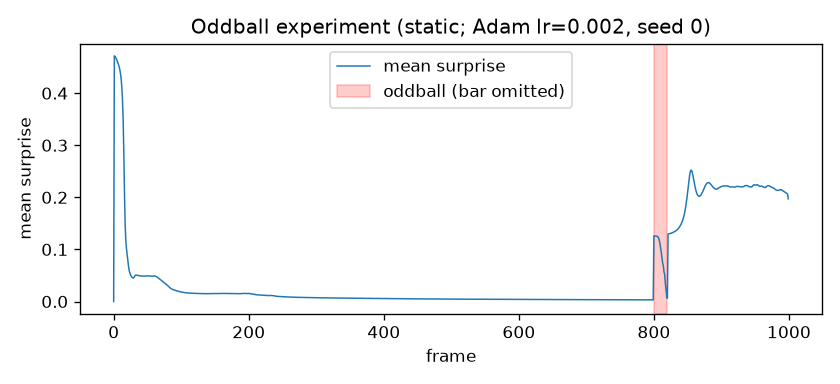
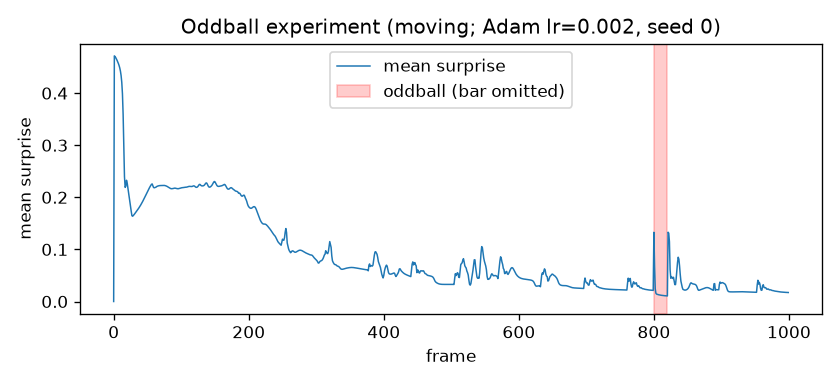

# Temporal Predictor — Report

## The model and the live demo

The temporal-predictor is a single-layer **ConvLSTM** ([convlstm.py](convlstm.py))
driven by an online learning loop ([main.py](main.py)). Every frame the loop does
three things: measure how wrong the previous guess was (`error = frame − prediction`
— that error map **is** the surprise), take one Adam step on the mean-squared error
to be less wrong, then predict the next frame from the current one. Because it
learns *while* watching, motion it has already seen becomes predictable and its
error decays toward zero on its own — the surprise map fades to black even while
the scene keeps moving. Only *failed* predictions stay bright. That decay is
repetition suppression; the rest of this report turns it into a measurement.

## Objective

Convert the temporal-predictor's qualitative "surprise fades" behaviour into a
quantitative measurement by reproducing the oddball / repetition-suppression
paradigm on controlled synthetic input. Two signatures are sought: the decaying
repetition-suppression curve, and the transient mismatch response to a
pattern-breaking deviant.

## Method

The model, optimiser, and online predict → error → step → re-predict loop are
identical to [main.py](main.py); only the input (synthetic rather than camera) and
the output (a logged per-frame surprise curve) differ. Implementation:
[oddball.py](oddball.py). Surprise is the mean absolute prediction error per
frame.

A single white bar (width 8 px on a 64×64 field) is presented for 1000 frames. For
frames 800–820 the bar is omitted (the deviant). Two standard stimuli were tested,
selected by the `STANDARD` constant:

- **static** — the bar is held at a fixed position.
- **moving** — the bar sweeps horizontally and wraps, with a period of
  `SIZE/STEP = 32` frames.

Figures below were generated with Adam (learning rate 2×10⁻³) and a fixed seed for
reproducibility.

## Results

### Static stimulus

Surprise decayed monotonically from 0.47 (frame 1) to a flat floor of 0.003 by
frame ~700 (standard deviation 0.000 over frames 770–799): the prediction
"next = current" is learnable exactly, so the residual error reaches the noise
floor and the surprise map goes effectively black.

The deviant produced a sharp mismatch response. At omission onset (frame 800)
surprise rose from 0.003 to 0.126. It then decayed to 0.006 over the 20-frame
omission as the model adapted to the constant blank input — the deviant itself
underwent repetition suppression. Restoration of the bar (frame 821) produced a
second mismatch response of comparable magnitude (0.130).

### Moving stimulus

Surprise again decayed from 0.47, but settled at a higher floor of 0.026
(standard deviation 0.005 over frames 770–799) rather than approaching zero. A
one-step-ahead predictor cannot place a sharp **moving** edge exactly, so a **residual
band of error persists at the bar's leading and trailing edges**; the surprise map
fades to dark grey rather than black. The **settled signal is not flat** but carries a
periodic ripple at the 32-frame sweep period (some phases of the sweep are harder
to predict than others) plus online-learning jitter.

The deviant response matched the static case in structure: a mismatch spike at
omission onset (0.133), decay to a trough of 0.011 during the omission, and a
second spike on restoration (0.133). The trough fell below the moving baseline of
0.026, because a **constant blank frame is more predictable than a moving bar**.

## Limitations and next step

This is a single-layer predictor operating directly on pixels. It can report only
that pixel-level input changed, never that the *structure* or *kind* of pattern
changed. Detecting higher-order, structural surprise requires a stacked predictor
in which each layer predicts the activity of the layer below — the subject of the
next project, the hierarchical-predictor.
